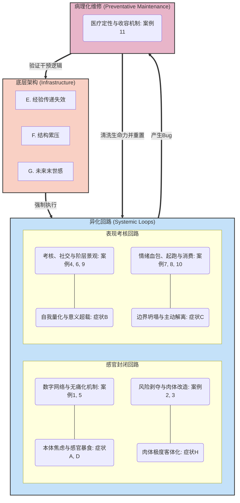

# 衔尾蛇：当代儿童的客体化机制与生存症状

本文档整合了“真实案例（机制层）”与“生存症状（体验层）”，并深入探讨了两者之间复杂的、互为因果的“衔尾蛇”闭环系统。

## 第一章 机制层：真实素材分类与拆解（作为“空能指”的儿童）

本章提炼了将现代儿童步步客体化的 11 种核心机制。每一种机制都将儿童掏空为一个用于承载特定成人欲望的“空能指”。

### 类别一：身体与感官的直接控制 (Direct Control of Body and Senses)
本类别侧重于技术与景观如何绕过思维，直接接管儿童的感官、空间运动与肉体生长。

#### 真实素材 1：数字资本的双面客体（从多巴胺喂养到网红生产）
*   **现实存在的机制**：一面利用算法劫持感官（高饱和度、高纯度刺激如“艾莎门”），使儿童被动沉浸于极速滑动的奶头乐中；另一面，诱导儿童像熟练的推销员一样拍摄“开箱视频”，用孩童特有的尖锐嗓音执行极其老练的带货法则。儿童既是终极的数字消费者，也是供成人消费的数字劳工。
*   **现实强加的空能指：“数字原住民” / “小网红”**：儿童不再是拥有连续叙事能力的主体。他们的眼睛成了吸收视觉垃圾的发黑漏洞，同时他们的身体成了迎合资本打赏的疲惫提词器。里面没有创造力，只有由于高频光电刺激带来的条件反射。

#### 真实素材 2：现代游乐场的“安全景观”与风险剥夺
*   **现实存在的机制**：现代游乐场全面铺设缓冲橡胶垫，移除了所有可能产生加速度和离心力的设备。儿童被放置在一个“物理上绝对不可能受伤，但也绝对体验不到失控”的无菌培养皿中。
*   **现实强加的空能指：“温室里的花朵” / “重点保护对象”**：游乐场的设计初衷不再是“探索”，而是成人的“免责声明”。儿童被剥夺了真实的痛感和边界试探，他们在这个景观里并不是在玩耍，而是在扮演“完全受保护的安全符号”。他们连受挫折和流血的资格都没有，只剩下一个平庸完好的橡胶假壳。

#### 真实素材 3：“军备竞赛化”的身体改造
*   **现实存在的机制**：为了让孩子在未来的精英阶层竞争中占据外貌和体格优势，系统/家长从小给孩子进行严酷的物理干预（注射生长激素打增高针、严苛的骨龄控制）。
*   **现实强加的空能指：“高颜值的未来之星” / “体格达标儿”**：儿童的身体不再遵从他们自己的基因发育法则，而是成为了成人意志强加的“盆景”或“高达机甲”。他们的骨骼和血肉被当作可以随意修改和优化的外设参数。在这种极端客体化之下，儿童的本体在这个被不断重组的肉体牢笼里彻底悬置。

### 类别二：内心世界的表格化 (Turning the Inner World into a Spreadsheet)
本类别侧重于如何将不可量化的童真、本能冲动和复杂情绪，强行纳入一套极度冷血的电子结算体系。

#### 真实素材 4：内部体验的精密考核（行为代币与情绪色谱）
*   **现实存在的机制**：儿童所有的内在表现都被标准化。举手和帮忙被计入“代币经济学”的电子白板分数（如ClassDojo）；连愤怒和委屈等原初生命力，也必须指认特定的“情绪色卡”，并按照标准化句式（“我很生气是因为…”）进行格式化汇报。
*   **现实强加的空能指：“三好学生” / “高情商儿童”**：“善良”不再是发自内心的同理心，成了一种冷冰冰的“交易筹码”；复杂的情绪被剥夺了合理存在的根基，成为必须“清零维修”的故障。在这套系统下长大的儿童，其内部动机被彻底掏空，成为一台只会精准执行“合规核算”的提款机。

#### 真实素材 5：“无痛化”的知识点溶解与浅薄化
*   **现实存在的机制**：教育App为了让儿童吃下知识点，将其强行溶解在无尽的声光电特效、开宝箱和收集宠物等“糖衣”中。儿童在过程中获得了由于点击而产生的高频快乐，但知识本身失去了内在逻辑美，变成不可跳过的广告。
*   **现实强加的空能指：“快乐学习者” / “闯关小达人”**：儿童不再是主动求知的主体，而是被按着头吞咽糖衣药片的反应堆。他们的认知过程被彻底浅薄化，承载的只是“通关进度”，这导致他们本应通过思考长出的复杂神经元被“糖化”的惰性取代，剩下空洞的兴奋感。

### 类别三：人际羁绊的功利计算 (Calculating Human Bonds)
本类别揭示了同龄人之间的纯粹玩耍，以及父母对孩子的无条件爱，是如何被利益计算与情绪索取彻底倒置的。

#### 真实素材 6：被“领导力培训”接管的自发玩耍
*   **现实存在的机制**：儿童最本能的社交（找小朋友玩），被包装成“培养领导力”、“团队协作”和“抗挫折训练”。几岁的小孩被要求像外企高管一样：坚定地握手、直视对方眼睛、在输赢面前表现得专业。
*   **现实强加的空能指：“小领导” / “社牛”**：儿童被迫穿上成年资本主义职场的“壳”。他们满嘴都是丛林社会的大词，但那只是一种被催熟的鹦鹉学舌。他们并不是真正自信的领袖，只是承载了家长对“未来成功人士”焦虑想象的西装塑料人偶，内部并没有长出真实的自我。

#### 真实素材 7：倒置的“情绪供体”与懂事病
*   **现实存在的机制**：精神内耗的成年人将孩子视为“唯一的光”，说“妈妈只有你了”、“为了你我才忍受”。孩子被迫穿上“救世主”的衣服，为了维持成人精神不崩溃，他们必须压抑自己正常的攻击性。
*   **现实强加的空能指：“贴心小棉袄” / “小大人”**：这是最深的掏空。儿童本应是被滋养和包容的一方，现在却被迫成了成人破碎灵魂的垃圾桶和情绪血包。所谓的“极度懂事”，是因为 ta 内部作为“儿童自己”的所有空间，都已经被父母溢出的绝望填满了，ta 成了一个专门兜底的空口袋。

### 类别四：作为阶层展演与填补焦虑的道具 (Props for Spectacle and Anxiety)
本类别探讨成人在面对财务恐慌或维护中产颜面时，如何完全无视儿童的“现在”，纯粹把他们当成金融展出与资本对冲的道具。

#### 真实素材 8：作为风险对冲的“简历童年与超前起跑线”
*   **现实存在的机制**：面对阶层滑落和未来的巨大不确定性，父母将时间疯狂前置。儿童被视为可以无限叠加技能指标（马术、钢琴）和知识储量（量子盲目早教）的期货资产。儿童的所有“现在”都被献祭给了那个永远不会到来的“未来”。
*   **现实强加的空能指：“牛娃” / “赢在起跑线上的神童”**：儿童纯粹沦为了一堆证书和技能矩阵的人肉载体。ta 承载了整个家族跨越阶层、防御坠落的全部指望。因为这件衣服实在太沉，这使得他们丧失了“身处当下”的权利。他们就是行走的家族KPI报表。

#### 真实素材 9：“童真景观”的视觉包装与阶层展演
*   **现实存在的机制**：无论是在朋友圈里摆拍“岁月静好”，还是在昂贵的人造夏令营泥巴坑里表演“回归自然”，儿童的真实探索行为完全是按剧本走的虚假布景。
*   **现实强加的空能指：“人类幼崽” / “大自然的孩子”**：孩子的真实生活体验被赛博空间的点赞逻辑接管，他们像动物园里被迫表演捕食的老虎。久而久之，孩子内部那个不愿笑、会弄脏衣服的真实的“我”死去了，剩下一个完全为了迎合镜头、固化中产人设的虚假审美皮囊。

#### 真实素材 10：消费主义涡轮的虚假暴君
*   **现实存在的机制**：“为了孩子好”是最高效的带货文案，家庭一切大额消费（学区房、昂贵兴趣班）都围绕孩子进行。孩子看似是最受宠爱的小皇帝。
*   **现实强加的空能指：“四脚吞金兽” / “碎钞机”**：孩子看似拥有最高权力，其实是毫无权力的终极账单背书人。这些消费更多是成人缓解焦虑的“赎罪券”。孩子承载了家庭庞大财务支出的道德绑架（“倾尽所有都是为你”），他们没有拒绝那些课程的权力，只能悲哀地坐在金钱堆砌的宝座上充当一个被剥茧抽丝的木偶。

### 类别五：将不顺从定义为“生病” (Defining Disobedience as an Illness)
当儿童在以上四大系统的碾压下，爆发出天然的反抗、混乱与不合作时，系统采取的终极冰冷手段。

#### 真实素材 11：反抗的医疗化消除（多动症与叛逆期的系统归化）
*   **现实存在的机制**：当系统要求幼童像成人般长时间静坐引发现然的“不守规矩”，或者儿童萌发自我意识产生激烈迷茫（如网瘾）时，系统立刻启动话语权，将其死死钉在“精神疾病”的标签上。
*   **现实强加的空能指：“ADHD（多动症）儿童” / “叛逆期综合症”**：系统用一个名为“疾病”的标签，强行解释了儿童“不适应反人性体系”的正常反应。通过药物服用（化学阉割后的专注）或防网瘾绝望训练（意志打碎），系统将其重新“修复”出厂设置。他们成了一个被剥夺解释权、原生生命力被完全抽空的活体祭品。

---

## 第二章 体验层：当代儿童的八大核心生存症状

A. **无菌景观里的微观操控与本体焦虑**
   控制过于细致入微，以至于儿童很难察觉到被控制。生活在物理上绝对无菌防摔的景观中，儿童失去建立“真实边界感”和“自我修复信心”的机会，呈现出“无痛的脆弱”，同时只能依靠本能进行先验的情绪宣泄（躯体化症状、无名火）。
B. **算法凝视下的自我量化与意义超载**
   儿童每一个自发的行为都被系统和镜头赋予沉重意义，并转化为可计数的代币或点赞。这种全天候的“算法凝视”榨干了儿童的“本真性”，迫使他们在冷冰冰的绩效打分中完成彻底的自我客体化。
C. **边界坍塌与为了幸存的主动解离**
   儿童被要求提前具备成人的情绪管理与履历思维，而成人却在心理退化并向儿童索取情绪价值。面对这种边界坍塌以及不同系统索求的截然不同的特质，儿童为了生存，只能提前将自我“切片”和“解离”，成为应对不同场景的完美且空洞的“多态接口”。
D. **感官暴食与“无聊”的结构性剥夺**
   儿童的神经回路被高强度的短平快刺激永久改变，同时时间也被极度颗粒化和效用化。失去了发呆的自留地（无聊），内生性想象力的孵化场被彻底破坏，大脑被浅薄化，欲望不再是自然生根，而是被外部精准填喂。
E. **经验传递的失效**
   时代变化太快，父母的经验地图失效。儿童在此境况下面面临一种隐秘的“孤儿状态”，只能摸黑前行，或被迫反向去“管理”父母的绝望与焦虑。
F. **历史与社会结构的层层累压**
   儿童的世界是被二战后、冷战、互联网时代乃至消费主义的各种残存结构观念层层挤压，面临着极其复杂、沉重且经常自相矛盾的社会指令。
G. **未来的取消与悬置的末世感**
   社会底色不再是“明天会更好”，成长变为防御阶层滑落而进行的一场漫长疲惫的军事化备考，生活纯粹处于向未来透支的状态。
H. **对自身肉体的极度客体化与陌生感**
   儿童体会不到身体是属于自己的感知媒介，而是把它当成一台随时需要满足外界指标、需要打补丁、打药升级的“外部机械”。肉身纯粹沦为数据和成人修饰欲望的载体。

---

## 第三章 衔尾蛇：机制与症状的深度系统性咬合

在当代儿童的生存场域中，现实机制与生存症状并非简单的“因果箭头”，而是构成了极其复杂的、互为基底且动态强化的**衔尾蛇系统**。本章通过三个核心“异化回路”来揭示这套系统的运作深度。

### 1. 结构性“底层架构”：症状 E 与 F 的隐形支撑
**症状 E（经验传递失效）** 与 **症状 F（结构层层累压）** 是整条衔尾蛇的脊椎，为所有的剥夺机制提供了“合法性”。
*   **深层逻辑**：因为长辈失去了对当下的理解力和对未来（**症状G 末世感**）的解释权（**症状E**），他们陷入了“锚点丧失”的恐慌。为了抵御这种恐慌，他们不仅没有放手，反而变本加厉地引入了最极端、最机械的指标控制（**案例8：简历童年与超前起跑线**）。
*   **互为因果**：这些机制并不是为了“解决”未来，而是为了缓解大人的“现在焦虑”。其结果是，儿童被卷入复杂的历史残余结构（**症状F**）中。当儿童在内部情绪核算（**案例4**）和消费主义（**案例10**）的夹击下陷入解离时，大人会认为这是因为“控制还是不够细”，从而引入更精密的数字监视与约束。

### 2. 回路 A：认知-感官的终极封闭 (Case 1, 2, 3, 5 $\leftrightarrow$ Symptom A, D, H)
这一回路揭示了外界如何通过直接修改“硬件（神经与肉体）”来消灭内部空间。
*   **多维互噬**：**案例 1（数字资本双面客体）** 与 **案例 5（无痛化知识溶解）** 联手，剥夺了儿童进行深度注意力训练的可能性。这不是单纯的快乐，而是**神经回路的重塑**，导致了内生想象力被剥夺和大脑浅薄化（**症状D 感官暴食与无聊剥夺**）。
*   **反馈效应**：这种大脑状态无法承受长逻辑的压力，为了维持这个系统的稳定，系统必须提供绝对安全的物理环境（**案例2**）和对身体的非自然改造（**案例3**），最终导致儿童感到**肉体是客观陌生的机械（症状H）**，从而滋生出无法被安抚的、建立在无菌环境假象上的**本体论焦虑（症状A）**。

### 3. 回路 B：表现即生存的“空能指”工厂 (Case 4, 6, 7, 9 $\leftrightarrow$ Symptom B, C)
这一回路展示了儿童如何被彻底训练成一套能够完美适配任何资本/社会指令的“虚空接口”。
*   **深层运作**：当善良和情绪变成代币（**案例4**），社交变成领导力演练（**案例6**），并且每一步都处于被晒娃和打分的凝视中（**案例9**），儿童的行为本身已经失去了“生命自发性”，只剩下了“为了被评价而存在”的被量化状态（**症状B 意义超载与自我量化**）。
*   **防御性清空**：面对全天候的绩效打分以及作为成人情绪血包（**案例7**）的沉重负担，儿童发现了唯一的生存法则。由于儿童必须展现出极其“懂事”的成人化样态，而成人却在退化，这种边界的彻底坍塌使得儿童内部成为了为了活下去而主动清空的无限墟井（**症状C 边界坍塌与主动解离**）。

### 4. 系统的病理化维修：衔尾蛇的最后闭环 (Case 11 $\leftrightarrow$ 所有症状)
当上述逻辑运转到极致，必然产生所谓的“崩溃”或“失控”。
*   **最后的一击**：当儿童表现出躯体化反应或无法专注时，系统启动。**疾病定义（案例11：反抗的医疗化消除）** 并不是在“救治”，而是在通过化学药物或物理隔离，**将“系统性的结构压迫”解释为“个体性的生理故障”**。这确保了系统及其背后的母语逻辑永远是无辜且正确的，而反抗的可能性在药片中被彻底消解，闭环至此完美合拢。

---

